# Run Code With Docker
docker-compose up --build

# Run Code Manually
```
cd frontend
npm install
npm run start

cd backend
npm install
node index.js 
```


## Mongodb Screenshots
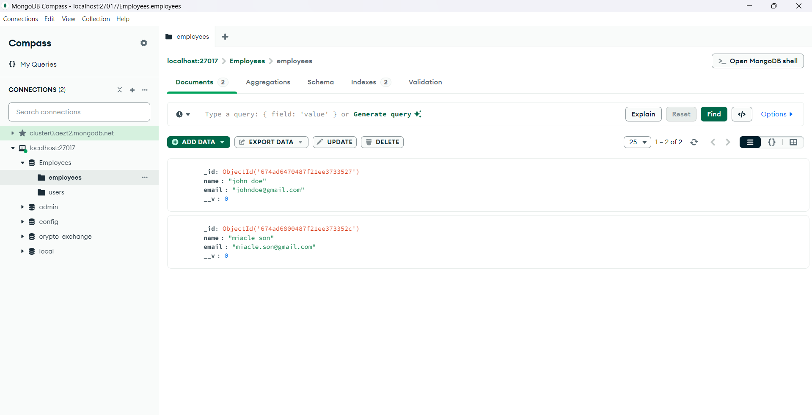

## API Screenshots
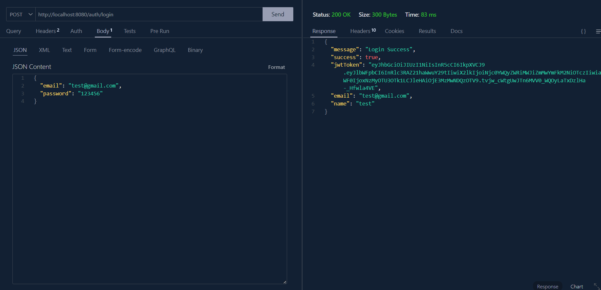
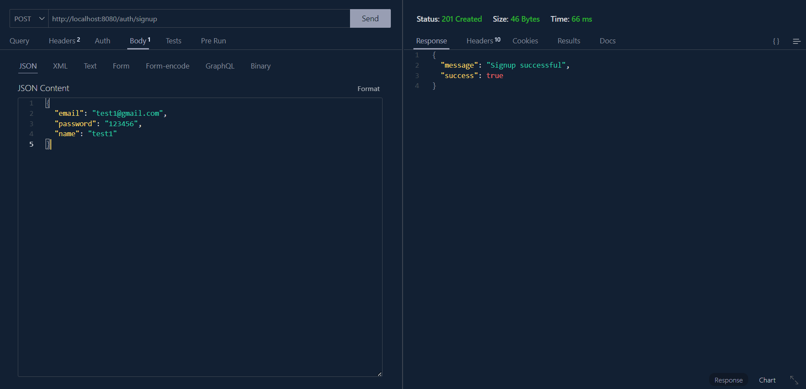
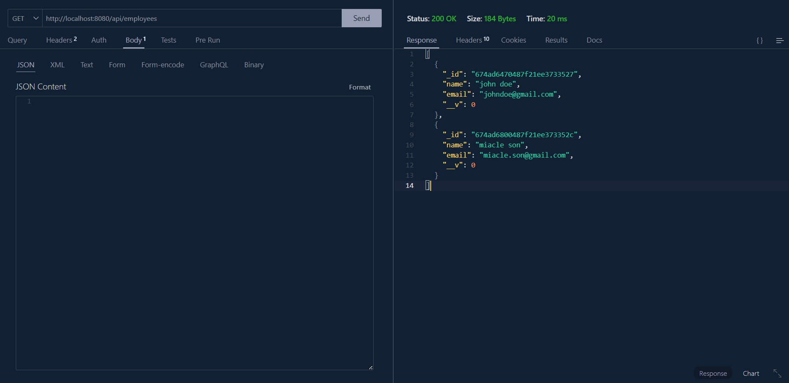
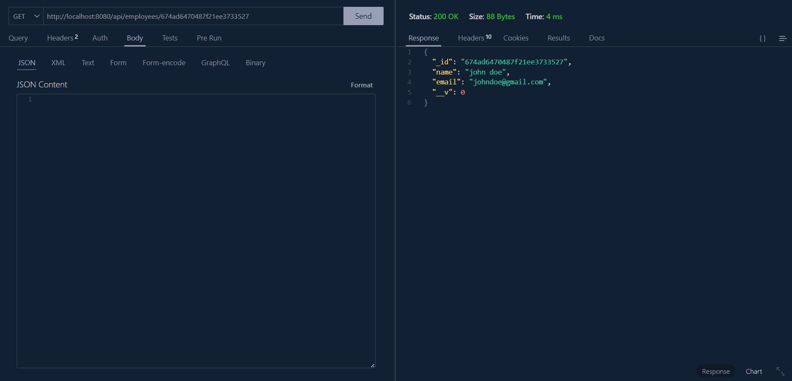
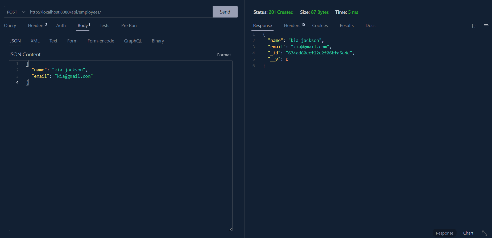


## UI Screenshots
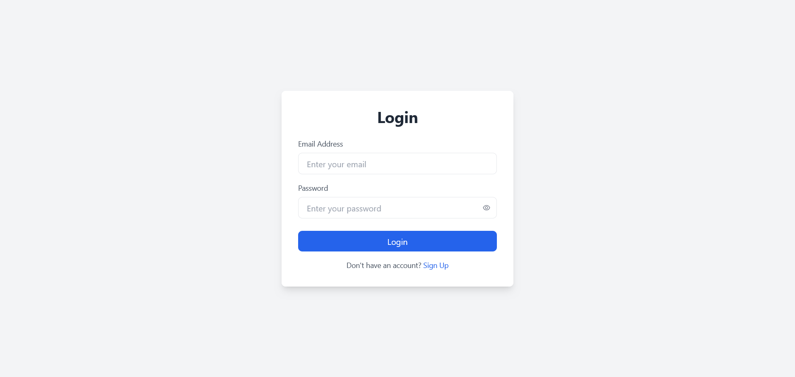
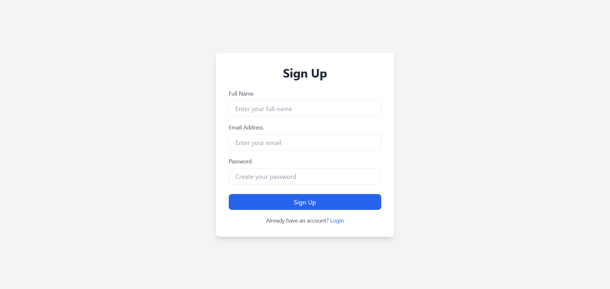
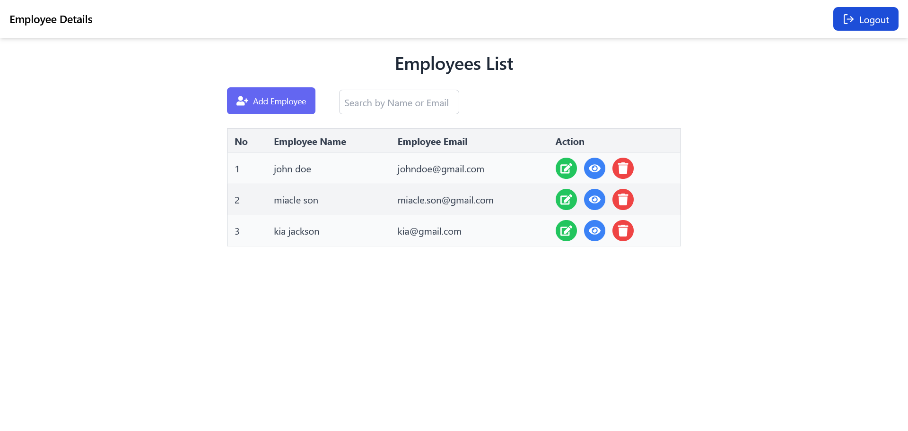
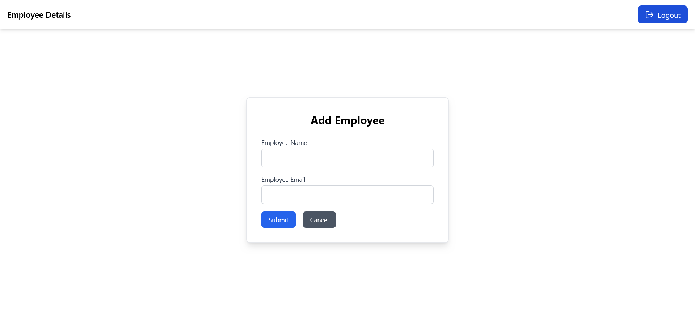
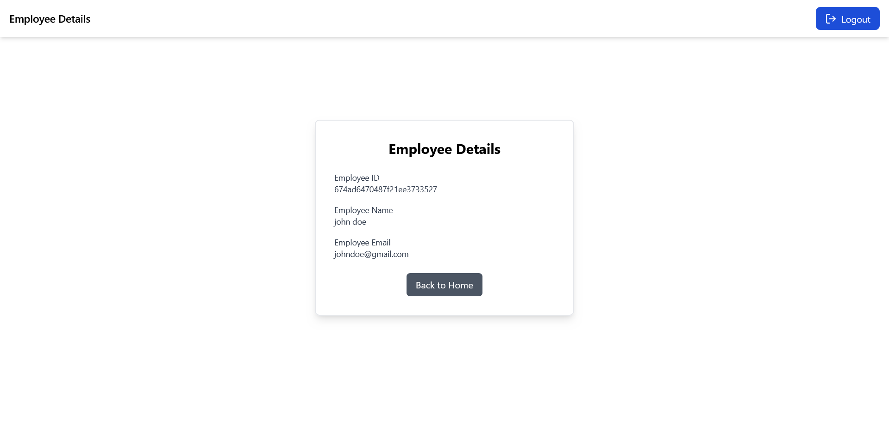
